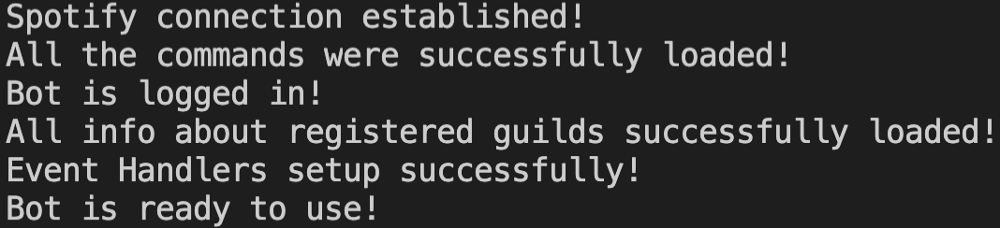

# Spotify Enhancer

## What Is?

Spotify Enhancer is a Discord Bot built with Node.js that (currently) notifies the users of a given server which artists released new music. Those artists are chosen by the users, and the releases are printed to the specified channels.

Since the Spotify API is used to get the latest releases and it needs to request a lot of times (often hitting rate limit), the search of new releases is done hourly.

## How it works?

As soon as the bot enters a new server, it will create a new channel called `releases-commands` where the people who have access to that channel have the possibility to configure which artists to follow, print releases of given artists, and so on.

Besides that, the bot will create a new role called `New Releases Manager`. People who have that role have the possibility to register and delete releases channels.

### Register/Delete Releases Channels

In order to register releases channels, you need to go to a channel (except `releases-commands`) and type `!SE addchannel`. To remove a releases channel, type `!SE removechannel`.

### Add Artists

As soon as the server have registered releases channels, it is possible to register artists. To do so, type `!SE+` and the names/Spotify URL/URI of the artists seperated by commas. 

**Example:**

```
!SE+ Coldplay, spotify:artist:6WMONlXvkrTWxC4TcI8qcD (use this if you only have one releases channel)
!SE+ Coldplay, spotify:artist:6WMONlXvkrTWxC4TcI8qcD #name_channel (use this if you have more than one releases channel)
```

### Remove Artists

If you don't want to follow some artists anymore, you can remove them by typing `!SE-` and the names of the artists seperated by commas.

**Example:**

```
!SE- The Weeknd, Joji, Porter Robinson
```

### Print New Releases of Artists

Sometimes on Spotify, the release that was supposed to be associated to a given artist is associated to a different one. If you want to print that release without registering the artist on the server, you can use `!SE new`.

**Example:**

```
!SE new Headhunterz, https://open.spotify.com/artist/2JqPH5sGxBA5lDMUmO5uAE?si=d8vw8bA9TlS0hxglNeFXQQ (use this if you only have one releases channel)
!SE new Headhunterz, https://open.spotify.com/artist/2JqPH5sGxBA5lDMUmO5uAE?si=d8vw8bA9TlS0hxglNeFXQQ #name_channel(use this if you have more than one releases channel)
```

## Features

The main features of this bot were discussed in detail previously, although you can always take a look at the full list of features/commands when typing `!SE help` on Discord.

**<u>Note</u>**: `!SE help` will print different results depending on which channel you wrote the command.

## Installation

### Requirements

In order to run the bot on your machine, you need:

* [Create an application on Spotify Developers](https://developer.spotify.com/dashboard/login)
* [Create an application on Discord Developers](https://discord.com/developers/applications)
* Latest version of [Node.js](https://nodejs.org/en/download/) installed
* Have a MongoDB database online or [install MongoDB on your PC/Mac](https://www.mongodb.com/try/download/community)

### Steps

1.  Install all dependencies using:

   ```bash
   npm install
   ```

2. Rename the file `config-example.json` to `config.json` and replace the fields with your information.

If everything goes smoothly, you should see this in your console:



## Contributing

Pull requests and issues are always welcome! Feel free to fork and develop/suggest your ideas.

It is my first big solo project, and some parts of the code are not very well documented/organized. If you have any doubts/concerns about the code, don't hesitate to contact me by opening a new issue.

## License
[GNU General Public License v3.0](https://www.gnu.org/licenses/gpl-3.0.html)
